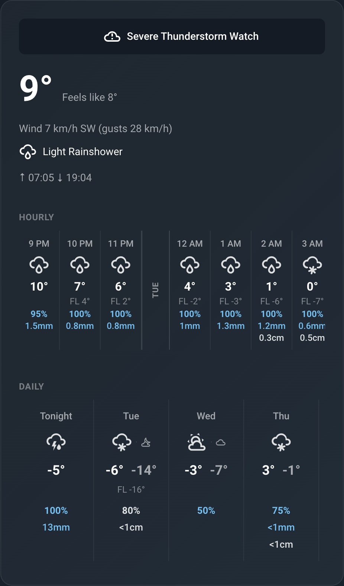
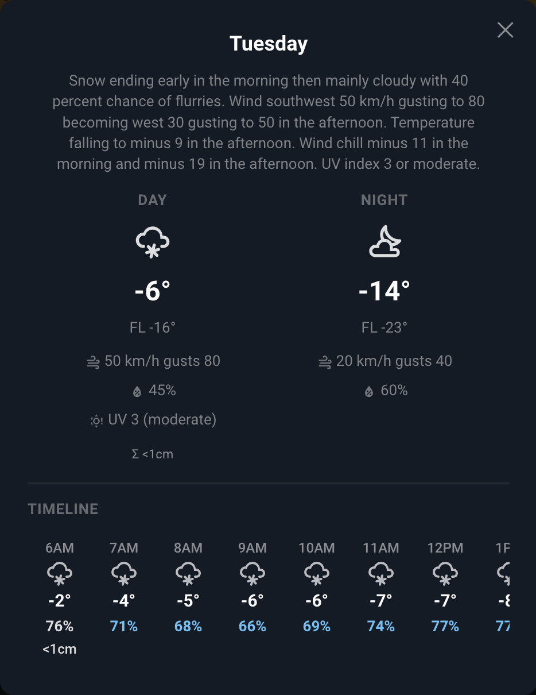

# EC Weather — Home Assistant Custom Integration

Custom integration that pulls weather data directly from Environment Canada's APIs and exposes it as HA sensor entities. Includes a built-in Lovelace card for displaying weather data. Bilingual (English/French).

<p>
  
  
</p>

## What it does

- Fetches current conditions, hourly forecast (48h), and daily forecast (7-day with day/night split) from Environment Canada
- Enriches forecasts with precipitation probability and amounts from GeoMet WMS (WEonG models — HRDPS 2.5km + GDPS 15km)
- Monitors active weather alerts for your area
- Tracks air quality (AQHI) with risk level
- Groups all entities under a single device in Home Assistant
- Provides a `WeatherEntity` (`weather.ec_weather`) for native HA widget compatibility
- Full English and French support — follows your HA language setting

### Tiered loading — fast and API-friendly

The card renders instantly from EC data (1 request, ~2 seconds), then enriches progressively in the background:

| Tier | What loads | When | API calls |
|------|-----------|------|-----------|
| **Instant** | Current conditions, hourly (24h), daily icons/temps/precip amounts | Dashboard open | 1 EC API call |
| **Background** | Hourly extends to 48h, daily gets POP%, rain/snow totals | 3-5s after render | ~200 GeoMet queries |
| **On popup open** | Per-timestep SkyState icons for the selected day | User taps a day | ~8-20 queries (cached) |

API usage is minimized through model-run-aware caching — data is only re-fetched when Environment Canada publishes new model output (HRDPS every 6h, GDPS every 12h).

## Location config

Location is configured via the HA UI config flow at setup time:

1. **Settings → Integrations → Add Integration → "Environment Canada Weather"**
2. Search for your city name (e.g. "Ottawa", "Vancouver", "Montréal")
3. If multiple matches, select the correct one from the dropdown
4. Review auto-discovered settings (AQHI station, bounding boxes) and edit if needed
5. Confirm to create the integration

### Editing settings after installation

Go to **Settings → Integrations → EC Weather → Configure** to edit:
- City code, language (en/fr)
- Alert bounding box, GeoMet WMS bounding box
- AQHI station ID
- Polling mode
- Refresh intervals (weather, AQHI, forecast detail)

The integration reloads automatically after saving changes.

### Polling Modes

Controls how the integration fetches data. Choose the mode that fits how you use it:

**Minimal** (default) — Only weather alerts poll continuously (every 30 minutes). All other data refreshes on-demand when you open the dashboard. Best if you check the weather occasionally.

**Efficient** — Alerts, current conditions, and AQHI poll continuously at their configured intervals. Forecasts refresh on-demand when the dashboard is viewed. Choose this if you use iOS lock screen widgets, temperature-based automations, or AQHI alerts.

**Full** — Everything polls continuously at configured intervals, including the forecast detail data from GeoMet WMS. Choose this if you want all data always up-to-date, or if you log weather data for analysis.

In all modes, weather alerts always poll every 30 minutes for safety.

## Entity inventory

All entities are grouped under a device named "EC Weather — {City Name}".

### Current conditions

| Entity | State |
|---|---|
| `sensor.ec_temperature` | °C |
| `sensor.ec_feels_like` | °C (wind chill or humidex) |
| `sensor.ec_humidity` | % |
| `sensor.ec_wind_speed` | km/h |
| `sensor.ec_wind_gust` | km/h (null when absent) |
| `sensor.ec_wind_direction` | Cardinal string (e.g. "NW") |
| `sensor.ec_condition` | Text (e.g. "Mostly Cloudy") |
| `sensor.ec_icon_code` | Integer (0-48), diagnostic |
| `sensor.ec_sunrise` | "HH:MM" local |
| `sensor.ec_sunset` | "HH:MM" local |

### Forecasts

| Entity | State | Attributes |
|---|---|---|
| `sensor.ec_hourly_forecast` | Last update timestamp | `forecast`: 48-hour list with temp, icon, POP, rain/snow |
| `sensor.ec_daily_forecast` | Last update timestamp | `forecast`: 7-day list with day/night split, timesteps |
| `sensor.ec_weather_summary` | Formatted string (e.g. "-8° · Feels -11° · Mostly Cloudy") | Diagnostic |

### Alerts

| Entity | State |
|---|---|
| `binary_sensor.ec_alert_active` | on/off |
| `sensor.ec_alert_count` | Integer, diagnostic |
| `sensor.ec_alerts` | Highest alert type; `alerts` attribute = list of dicts |

### Air quality

| Entity | State | Attributes |
|---|---|---|
| `sensor.ec_air_quality` | Float (e.g. 3.0) | `risk_level`, `forecast_datetime` |

### iOS lock screen gauge

| Entity | State | Attributes |
|---|---|---|
| `sensor.ec_temp_gauge` | Float 0.0-1.0 (gauge arc position) | `value`, `low`, `high` |
| `sensor.ec_feels_gauge` | Float 0.0-1.0 (gauge arc position) | `value`, `low`, `high` |

Pre-computed sensors for the HA Companion App's iOS lock screen gauge widget. The state maps -40°C to +40°C onto 0.0-1.0.

### Weather entity

| Entity | Purpose |
|---|---|
| `weather.ec_weather` | Native WeatherEntity for companion app widgets |

## Lovelace Card

The integration includes a custom Lovelace card (`ec-weather-card`) that renders weather data with no external dependencies. The card auto-registers at startup — no manual resource configuration needed.

### Usage

```yaml
type: custom:ec-weather-card
section: current
```

### Sections

| Section | Description |
|---------|-------------|
| `alerts` | Weather alert banners with expand/collapse. Hidden when no alerts are active. |
| `current` | Current temperature, feels-like, wind, AQHI, condition icon, sun times, and daylight remaining. |
| `hourly` | Scrollable 48-hour forecast with temperature, feels-like, precipitation probability, and rain/snow amounts. Day separators at midnight boundaries. |
| `daily` | Scrollable 7-day forecast with day/night icons, temperatures, feels-like, precipitation. Tap a day for detail overlay with wind, humidity, UV index, precipitation amounts, and hourly timeline. |

### Full weather panel example

```yaml
type: vertical-stack
cards:
  - type: custom:ec-weather-card
    section: alerts

  - type: custom:ec-weather-card
    section: current

  - type: custom:ec-weather-card
    section: hourly

  - type: custom:ec-weather-card
    section: daily
```

### Theming

The card is **theme-aware** and adapts to any Home Assistant theme (light or dark) automatically. It reads HA's built-in CSS variables so colors match your active theme out of the box.

Colors resolve in this order:
1. **Card-specific override** (`--ec-weather-*`) — if set, takes priority
2. **HA theme variable** — adapts to your active theme automatically
3. **Hardcoded fallback** — dark theme defaults as last resort

| Property | HA theme fallback | Description |
|----------|-------------------|-------------|
| `--ec-weather-text-primary` | `--primary-text-color` | Primary text color |
| `--ec-weather-text-secondary` | `--secondary-text-color` | Secondary text |
| `--ec-weather-text-muted` | `--secondary-text-color` | Muted text (feels-like) |
| `--ec-weather-precip-rain` | — | Rain precipitation color |
| `--ec-weather-precip-snow` | `--primary-text-color` | Snow precipitation color |
| `--ec-weather-alert-warning` | — | Warning alert color |
| `--ec-weather-alert-watch` | — | Watch alert color |
| `--ec-weather-alert-advisory` | — | Advisory alert color |
| `--ec-weather-alert-statement` | `--secondary-text-color` | Statement alert color |
| `--ec-weather-divider` | `--divider-color` | Divider line color |

## Installation

### HACS (recommended)

1. Open HACS in your Home Assistant instance
2. Click the three dots menu (top right) → **Custom repositories**
3. Add the repository URL and select **Integration** as the category
4. Click **Download**
5. Restart Home Assistant
6. Go to **Settings → Integrations → Add Integration → "Environment Canada Weather"**

The Lovelace card auto-registers — no separate card installation needed.

### Manual

Copy the `ec_weather` folder to `config/custom_components/` and restart Home Assistant.
