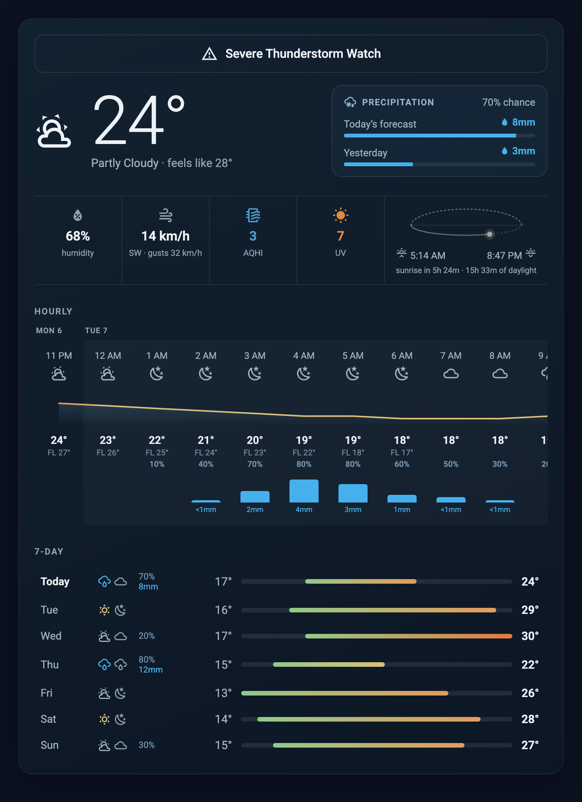
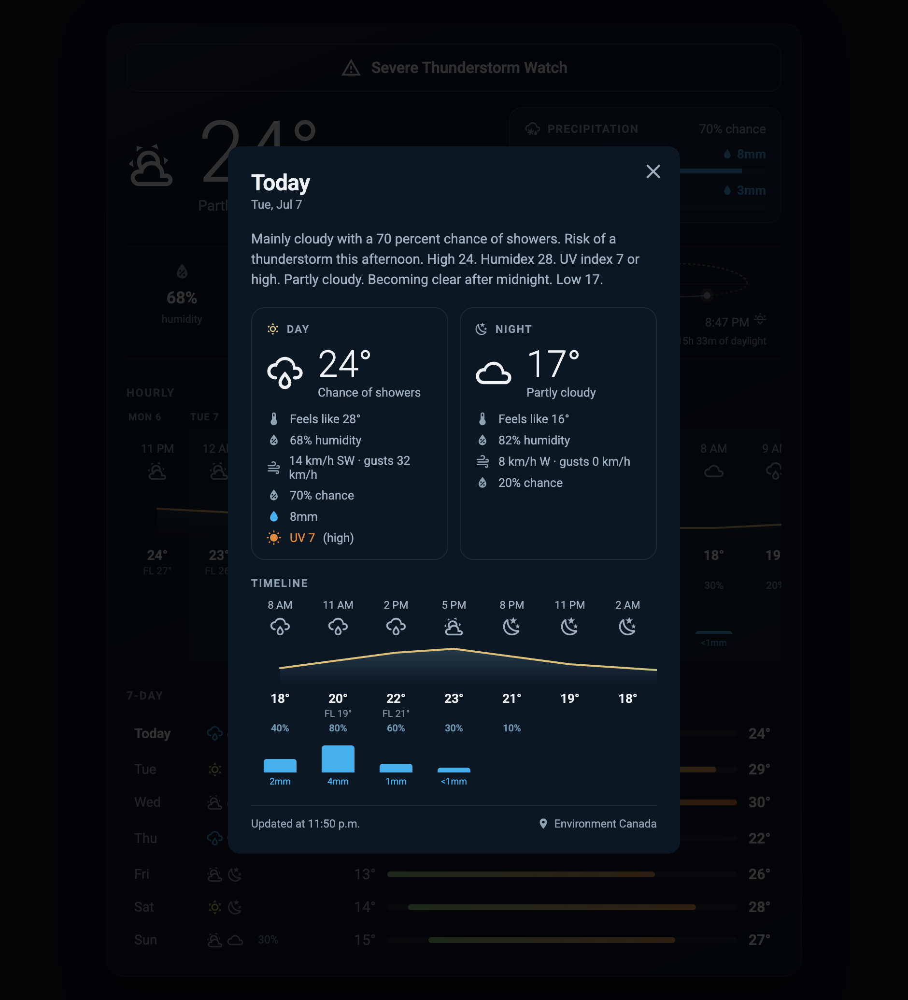
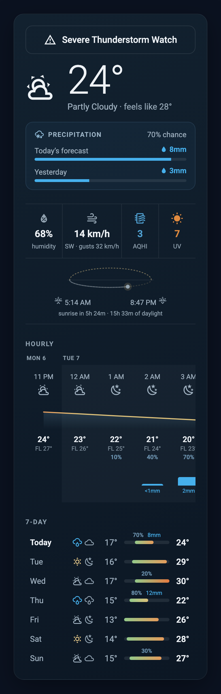
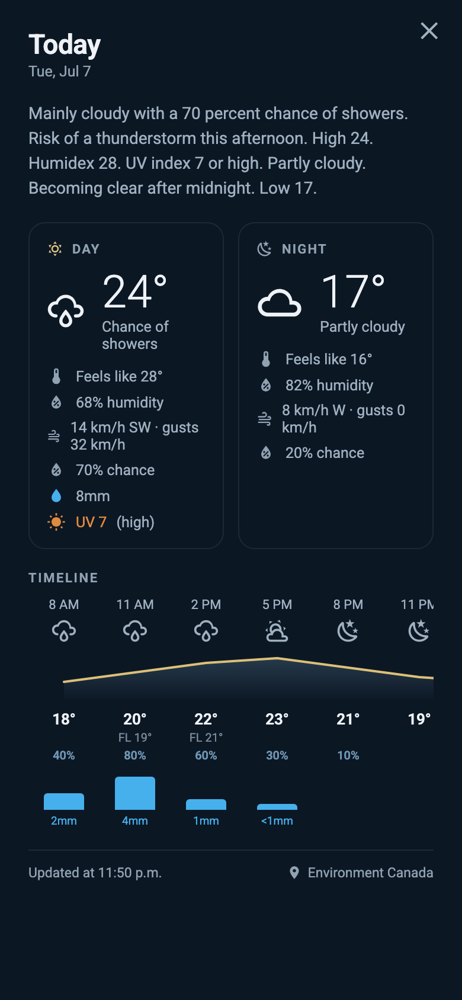
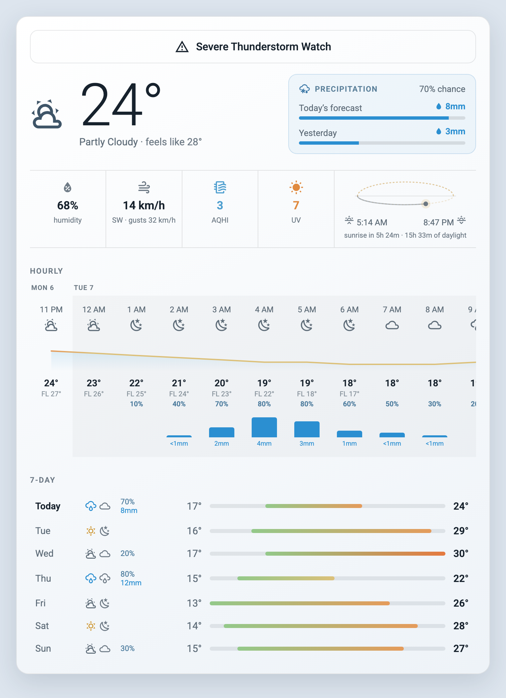
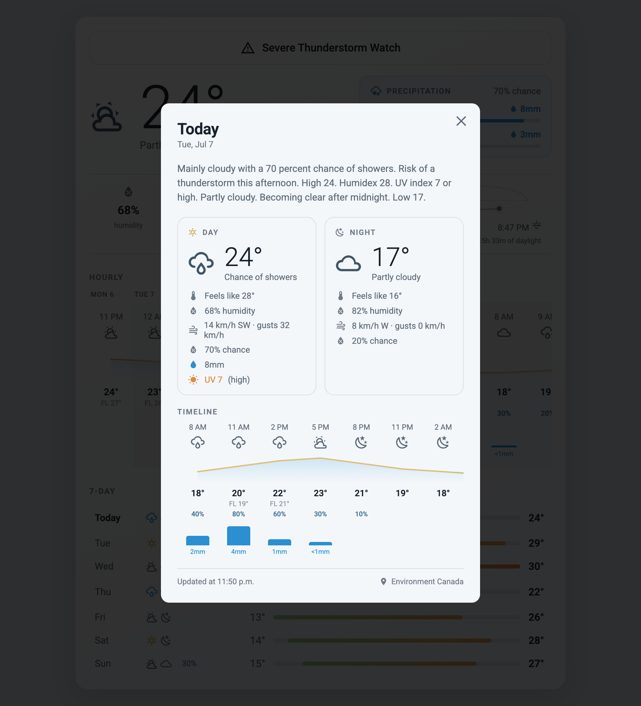

# Screenshots

All images are generated from synthetic demo data by
[`www/screenshot-tool/`](../custom_components/ec_weather/www/screenshot-tool/)
and regenerate with every release.

## Dashboard

## Day detail popup

Tap any day in the 7-day list (or the hourly strip's day) to open the
detail view — narrative forecast, day/night cards, hourly timeline.

## Mobile

The card reflows for narrow tiles: the hero and precipitation panel
stack, the metric bar wraps, and the 7-day range bars take the full
width with precipitation floating above each wet day's bar.

| Dashboard | Day detail |
|---|---|
|  |  |

## Light theme

The card follows your Home Assistant theme automatically.

